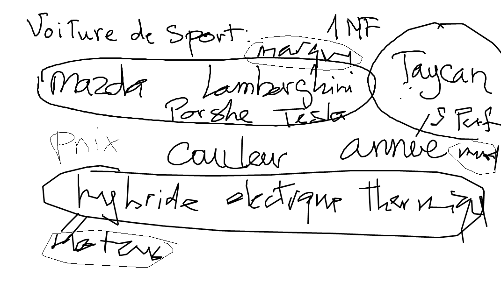

# 3NF.txt

| Student :id:               | Mark                |
|----------------------------|---------------------|
| [300104524](300104524.txt) |                     |
| [300104541](300104541.txt) |                     |
| [300105201](300105201.txt) |                     |
| [300106918](300106918.txt) |                     |
| [300107361](300107361.txt) |                     |
| [300108234](300108234.txt) |                     |
| [300110500](300110500.txt) |                     |
| [300110529](300110529.txt) |                     |
| [300111671](300111671.txt) |                     |
| [300111766](300111766.txt) |                     |
| [300112017](300112017.txt) |                     |
| [300112687](300112687.txt) |                     |
| [300112917](300112917.txt) |                     |
| [300113775](300113775.txt) |                     |

https://www.linkedin.com/learning/database-foundations-storage/reducing-redundancy-with-normalization

