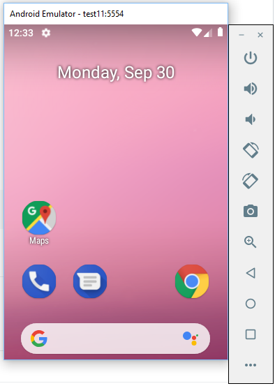

## Windows


:bookmark: Ouvrir git bash

* Installer l'emulateur, les differents outils et la derniere version de la SDK Android

```bash
$ $ANDROID_HOME/tools/bin/sdkmanager.bat "emulator" "platform-tools" "platforms;android-28" "build-tools;28.0.3" "extras;android;m2repository" "extras;google;m2repository"
```

* Creer le AVD (Android Virtual Device) avec un SDK

```bash
$ $ANDROID_HOME/tools/bin/avdmanager.bat create avd --name test --package "system-images;android-28;google_apis;x86_64"
Auto-selecting single ABI x86===========] 100% Fetch remote repository...
Do you wish to create a custom hardware profile? [no] no
```

* Lancer l'appareil virtuel Android

```bash
$ emulator -avd test &
```

* Jouer avec l'AVD


