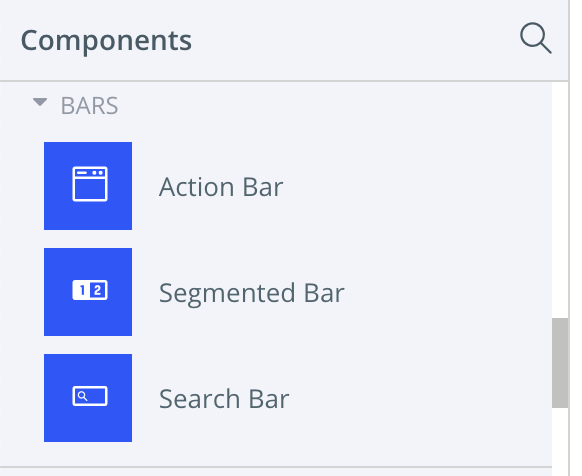
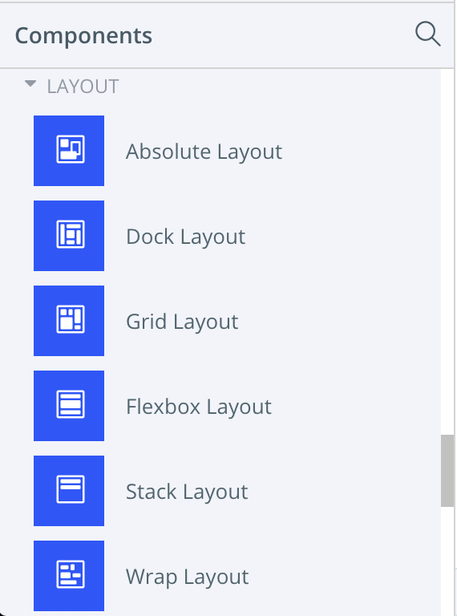
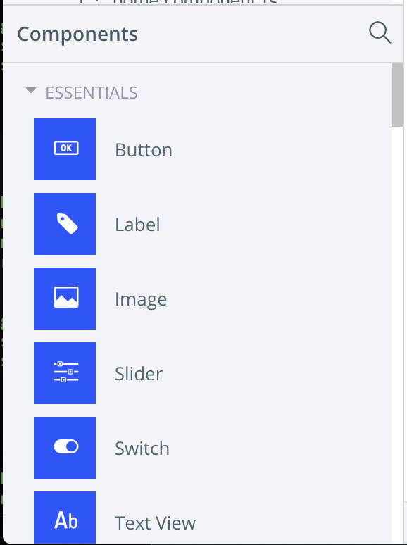

# TNS CLI Blank Template

:zero: Dessiner, à la main, une page d'un écran mobile (sketch) et en prendre une photo 

:bulb: Ce `sketch` sera utiliser pour créer une application mobile

```
La page comprendra du texte et une ou des images
```

* montrer l'image du `sketch` dans son fichier `README.md` (voir ci-dessous)

:one: Créer un projet, remplacer `my` dans `my-blank-ng` par b`<`votre :id:`>`

:bulb: par example le nom du projet sera `b300098957-blank-ng` 

* Création

```
$  tns create my-blank-ng --template tns-template-blank-ng
```

:two: En s'aidant de [play.nativescript.org](https://play.nativescript.org), Remplacer le `template` du composant application pour afficher:

* Une barre d'action



* Un layout



* Deux `Labels` et une `Image`



:three: Activités `git` et [MarkDown](https://github.com/CollegeBoreal/Tutoriels/tree/master/M.MarkDown)

* Créer un fichier README.md

* Ajouter des commentaires sur votre projet dans le fichier README.md

* Faire une copie d'écran de votre simulator (emulator), sauvegarder les fichier et l'afficher dans README.md

* Utiliser les commandes `git` pour envoyer votre projet sous github

# [Participation](Participation.md)
