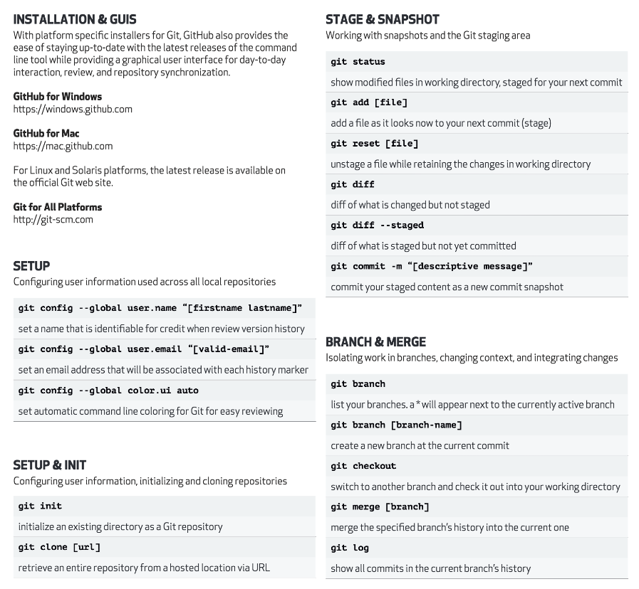
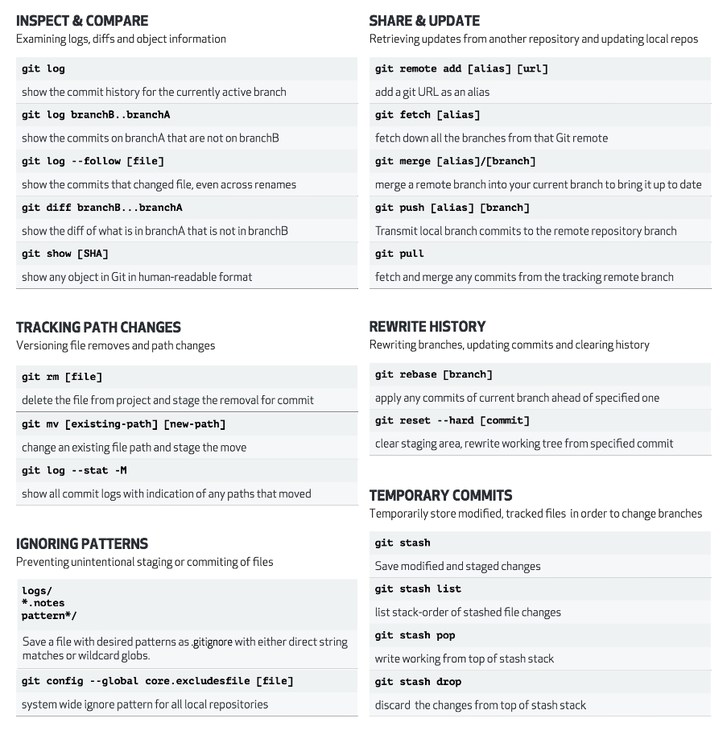

# Git Révisions

## Première page:

* Setup

* Setup & Init

* Stage & Snapshot

* Branch & Merge

## Deuxième page:

* Inspect & Compare

* Tracking Path Changes

* Ignoring Patterns

* Share & Update

