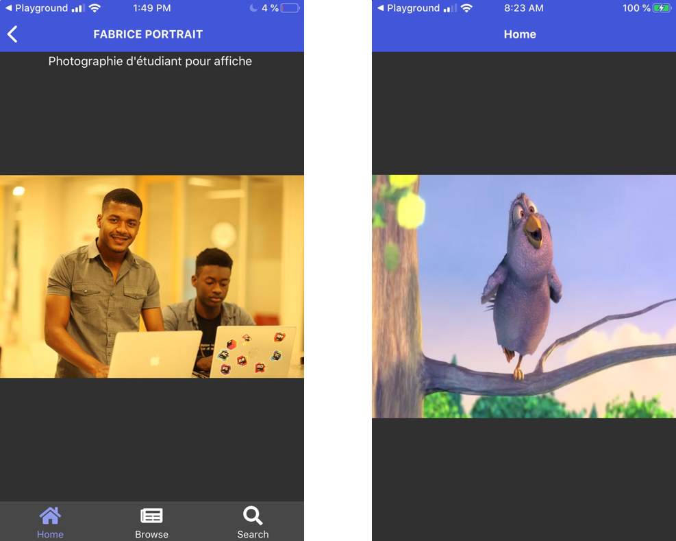

:one:   Au prime à bord  j'ai crée 3 pages à savoir Home que j'ai appelé WIDESIGN , Browse , and Search . A l'aide de l'outil powerpoint je mets des frames tout au tour pour que ca ressemble plus ou moins à un téléphone . à la fin je mets les 3 pages l'un à coté de l'autre tel que demandé .:point_down:

:two:    Le but de cet exercice c'était de créer une application pour un client qui reflète le sketch que vous l'avez proposé :point_up:.

En utlisant angular et generer des services depuis un terminal(gitbash) et une base de donnée Rapid API. :point_down:

:three:    Quand vous cliquez sur l'article portrait fabrice :point_down:  -------------------------------:four:    Mon resultat avec V.video :point_down:

