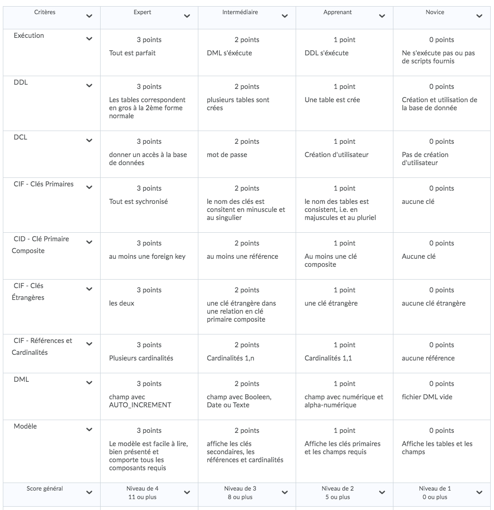

# Participation

## Execution

* Remplacer `<id>` par son :id:

* Charger le schema

```
$ docker exec --interactive some-mysql \
         mysql --user root -ppassword < ~/Developer/INF1006-202-19A-01/4.DML/<id>/<id>-schema.sql
```

* Charger les données

```
$ docker exec --interactive some-mysql \
         mysql --user root -ppassword < ~/Developer/INF1006-202-19A-01/4.DML/<id>/<id>-data.sql
```

## Resultat


|:hash:| :id:                   | SQL Existe         | Execution                           |
|------|------------------------|--------------------|-------------------------------------|
| 01   | [300104524](300104524) | :heavy_check_mark: | :x:                                 |
| 02   | [300104541](300104541) | :heavy_check_mark: | :x:                                 |
| 03   | [300105201](300105201) | :heavy_check_mark: | :heavy_check_mark:                  |
| 04   | [300106918](300106918) | :heavy_check_mark: | :x:                                 |
| 05   | [300107361](300107361) | :heavy_check_mark: | :x:                                 |
| 06   | [300108234](300108234) | :heavy_check_mark: | :x:                                 |
| 07   | [300110500](300110500) | :heavy_check_mark: | :x:                                 |
| 08   | [300110529](300110529) | :heavy_check_mark: | :heavy_check_mark:                  |
| 09   | [300111671](300111671) | :x:                | :x:                                 |
| 10   | [300111766](300111766) | :x:                | :x:                                 |
| 11   | [300112017](300112017) | :x:                | :x:                                 |
| 12   | [300112687](300112687) | :x:                | :x:                                 |
| 13   | [300112917](300112917) | :heavy_check_mark: | :heavy_check_mark:                  |
| 14   | [300113775](300113775) | :heavy_check_mark: | :heavy_check_mark:                  |


## [Corrections](Corrections)

* Nettoyer MySQL

```
$ docker container rm -f some-mysql
$ docker run --name some-mysql --env MYSQL_ROOT_PASSWORD=password --publish 33060:3306 --detach mysql:5.7
```

* Exécuter le script de correction

```
$ sh notation.sh > Corrections/README.md 2>&1
```

## [Criteres]


