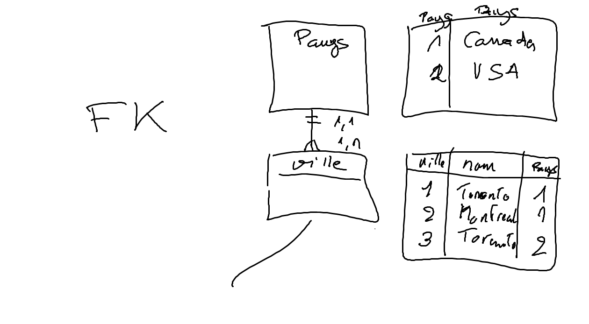

# Quizz (2019-11-19)

[:bulb: What are DDL, DML and DQL?](https://en.wikibooks.org/wiki/MySQL/Language/Definitions:_what_are_DDL,_DML_and_DQL%3F)

## :a: DDL

:one: CREATE {DATABASE/TABLE/USER} (target);

##### :m: DATABASE

```SQL
> CREATE DATABASE <name>;
```


##### :m: TABLE

```SQL
> CREATE TABLE <name> ( 
    <nom_champ1> <type1> <option1>, 
    <nom_champ2> <type1> <option2>, 
    ...
  );
```

:pushpin: Type :

| Type                 |  SQL                  | Format                   |
|----------------------|-----------------------|--------------------------|
| Nombre               |INT, DOUBLE, FLOAT     | 1 - 10, 1.0 - 10.0       |  
| Date                 | DATE                  | '1990-01-01'             |
| booleen              | BOOLEAN               | True, False              |
| Chaine de caracteres | VARCHAR(<size>), TEXT | '1', '2.6', '2009-12-02' |
  
:pushpin: Option: 

| Option             | Description                                                  | 
|--------------------|--------------------------------------------------------------|
| AUTO_INCREMENT     | Omettre (N'apparait pas) dans le INSERT statement            |
| NOT NULL           | Le champ ne peut etre nul sinon Erreur                       |
| PRIMARY KEY        | :bulb: Peut etre placé ailleurs                              |
| DEFAULT `<valeur>` | :question:                                                   |

##### :m: USER 

:pushpin: Adresse IP Locale

```SQL
> CREATE USER 'nom'@'localhost' IDENTIFIED BY 'passwd'; -- Utilisateur accedant a la machine locale
```

:pushpin: Adresse IP Distante (avec `wildcard` **%** )

```SQL
> CREATE USER 'nom'@'%' IDENTIFIED BY 'passwd'; -- Utilisateur accedant a la machine distante
```

:two: DROP {DATABASE/TABLE} <name>;

##### :m: DATABASE

```SQL
> DROP DATABASE <name>;
```

##### :m: TABLE 

```SQL
> DROP TABLE <name>;
```
##### :m: USER 

```SQL
> DROP USER <name>;
```

:three: Keys :key:
 
 ##### :m: [Primaire](http://www.mysqltutorial.org/mysql-primary-key/) 
     
```SQL
    CREATE TABLE CLIENTS ( ...
       client INT AUTO_INCREMENT,
    
    
    PRIMARY KEY(client)    
    );
``` 

##### :m: composite (Primaire) 

```SQL
    CREATE TABLE VENTES ( ...
       produit INT,
       client INT,
    
    
    PRIMARY KEY(produit, client)    
    );
``` 
 ##### :m: Etrangere
 
 
```SQL
    CREATE TABLE VILLES ( ...
       ville INT,
       pays INT,
    
    
    FOREIGN KEY(pays) REFERENCES PAYS(pays),
    );
``` 

</img>
 

:b: DCL


:four: Permissions

##### :m: [GRANT](http://www.mysqltutorial.org/mysql-grant.aspx)

```
> GRANT <Privilege> ON <base de donnee>.<tables> (ou `*` wildcard) TO <USER>;  
```

##### :m: [REVOKE](http://www.mysqltutorial.org/mysql-revoke.aspx)

```
> REVOKE <Privilege> ON <base de donnee>.<tables> (ou `*` wildcard) TO <USER>;  
```

:pushpin: Privileges 

| Privileges | Description                   | 
|------------|-------------------------------|
| ALL        | Tous les privileges           |
| SELECT     | Lecture seulement             |
| INSERT     | Ajout uniquement              |


:ab: DML

voir `INSERT`


:o2: MySQL Admin Commands

:m: SHOW <artifacts>
    
```
mysql> SHOW DATABASES;
```

```
mysql> SHOW TABLES;
```

```
mysql> SHOW GRANTS FOR rfc@localhost;
```

:m:  describe

```
mysql> DESCRIBE <nom de table>;
```


:m:  use

```
mysql> USE <database>;
```

