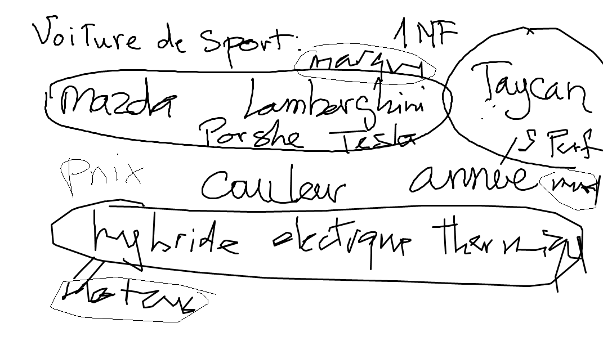

# 3NF.txt

## Légende

| Signe              | Signification                 |
|--------------------|-------------------------------|
| :heavy_check_mark: | Prêt à être corrigé           |
| :recycle:          | Plus de travail requis        |
| :heavy_minus_sign: | Projet Créé                   |
| :x:                | Projet inexistant             |

## Participation

| Student :id:               | Mark                          |
|----------------------------|-------------------------------|
| [300104524](300104524.txt) | :heavy_minus_sign: |
| [300104541](300104541.txt) | :recycle: |
| [300105201](300105201.txt) | :heavy_minus_sign: |
| [300106918](300106918.txt) | :heavy_minus_sign: |
| [300107361](300107361.txt) | :heavy_minus_sign: |
| [300108234](300108234.txt) | :heavy_check_mark: |
| [300110500](300110500.txt) | :recycle:                           |
| [300110529](300110529.txt) | :heavy_minus_sign: |
| [300111671](300111671.txt) | :heavy_minus_sign: |
| [300111766](300111766.txt) | :x:                           |
| [300112017](300112017.txt) | :x:                           |
| [300112687](300112687.txt) | :x:                           |
| [300112917](300112917.txt) | :heavy_minus_sign: |
| [300113775](300113775.txt) | :heavy_check_mark: |

https://www.linkedin.com/learning/database-foundations-storage/reducing-redundancy-with-normalization

