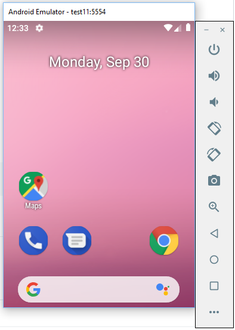

## Windows


:bookmark: Ouvrir git bash

* Installer l'emulateur, les differents outils et la derniere version de la SDK Android

:warning: Sous Windows ajouter l'extension `.bat` à `sdkmanager`

```bash
$ sdkmanager "emulator" "platform-tools" "platforms;android-28" "build-tools;28.0.3" "extras;android;m2repository" "extras;google;m2repository"
```
* Installer le package Android SDK version 28

```bash
$ sdkmanager --install "system-images;android-28;google_apis;x86_64"
```

* Creer le AVD (Android Virtual Device) avec un SDK

```bash
$ avdmanager create avd --name test --package "system-images;android-28;google_apis;x86_64"
Auto-selecting single ABI x86===========] 100% Fetch remote repository...
Do you wish to create a custom hardware profile? [no] no
```

* Lancer l'appareil virtuel Android

```bash
$ emulator -avd test &
```

* Jouer avec l'AVD



## Problème de JDK

modifier votre JDK en "/c/Program Files/java/jdk1.8.0_221"

example export JAVA_HOME="/c/Program Files/java/jdk1.8.0_221"

```bash
$ nano ~/.bashrc
```

# Variables d'environemment

* Ouvrir le fichier `~/.bashrc` avec `nano`

* ajouter les alias suivants

```
alias sdkmanager=sdkmanager.bat
alias avdmanager=avdmanager.bat
```
